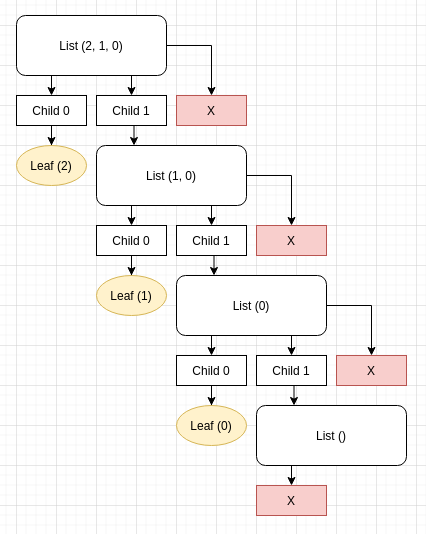
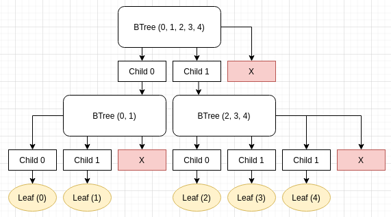
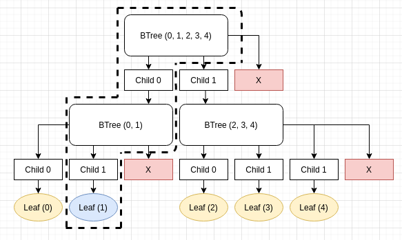

# Announcing microkelvin 0.7

Microkelvin is a toolkit for making advanced custom datastructures easy to implement for use in smart contracts.

The library is also an attempt at streamlining the creation of merkle tree datastructures, with modular and flexible indexing and lookup behaviours.

## Background

Bitcoin made the Merkle Tree construction famous around technology enthusiasts, and is a core technology in everything happening in the blockchain space.

However, each project, be it Bitcoin, Ethereum, etc implements their own versions of these datastructures.

Additionally, if you're writing an ethereum contract, you are limited to using the key-value patricia trie provided by the contract storage mechanisms of ethereum.

There are ways around this, and people have been constructing other datastructures _on top_ of the key-value store, for example this [linked list implementation in solidity](https://github.com/vittominacori/solidity-linked-list).

As the saying goes, every problem in computer science can be solved with an additional layer of indirection, except the problem of too many layers of indirection.

Our goal with this library is to remove one layer of indirection and allow users to create their own datastructures as first-class citizens of the environment.

## Examples

Let's make our own merkle powered linked list!

```rust
#[derive(Clone, Canon, Debug)]
pub enum LinkedList<T, A> {
    Empty,
    Node { val: T, next: Annotated<Self, A> },
}
```

Fairly straightforward, the list can be either empty, or it could have an element and a "next" value.

But what is this `Annotated<Self, A>` you speak of? We'll get to that later. for now you can think of it as just a smart pointer to another `LinkedList`.

Let's implement an insert-function.

```rust
impl<T, A> LinkedList<T, A>
{
    pub fn insert(&mut self, t: T) {
        *self = LinkedList::Node {
            val: t,
            next: Annotated::new(core::mem::take(self)),
        };
    }
}	
```

Yep, just set the current node to a node with the provided value, and the `next` to what was `self` before, wrapped in an `Annotated` indirection.

So far so good, we have a linked list that we can insert things into.

Soo, how do we look at what we got in there? We could implement it ourselves, but the whole point of `microkelvin` is to make common operations just work out of the box for any datastructure.

Here is the [full implementation of a linked list](https://github.com/dusk-network/microkelvin/blob/walker_refactor/tests/linked_list.rs), from the test suite.

## Compound trait

To hook our linked-list into the library we will need to implement a simple interface trait for our datastructure.

```rust
pub trait Compound<A>: Sized + Canon {
    /// The leaf type of the Compound collection
    type Leaf;

    /// Returns a reference to a possible child at specified offset
    fn child(&self, ofs: usize) -> Child<Self, A>
    where
        A: Annotation<Self::Leaf>;

    /// Returns a mutable reference to a possible child at specified offset
    fn child_mut(&mut self, ofs: usize) -> ChildMut<Self, A>
    where
        A: Annotation<Self::Leaf>;
}
```

In our case, the linked list, given an offset of 0, would return either `Child::EndOfNode` or `Child::Leaf`, and with larger indicies it will refer to its tail with `Child::Node`.

With this trait, the library knows how to query the structure for tree-traversal.

Let's concider the simple list `(2, 1, 0)`. In our example this would be represented as a microkelvin tree in the following way:



## Branches

Our linked list example is of course a bit limited, but the diagram above shows that linked lists can be thought of as "unary trees".

Let's imagine a naive binary tree.



A `microkelvin` branch down this tree could be represented as such graphically.



The above branch contains two levels into the BTree struct, and the offsets 0 and 1, which corresponds to the children traversed down the tree.

## Walking

In order to construct a branch down the tree we use the `Walker` trait.

```rust
/// Walker that visits all leaves
pub struct AllLeaves;

impl<C, A> Walker<C, A> for AllLeaves
where
    C: Compound<A>,
    A: Annotation<C::Leaf>,
{
    fn walk(&mut self, walk: Walk<C, A>) -> Step {
        for i in 0.. {
            match walk.child(i) {
                Child::Leaf(_) => return Step::Found(i),
                Child::Node(_) => return Step::Into(i),
                Child::Empty => (),
                Child::EndOfNode => return Step::Advance,
            }
        }
        unreachable!()
    }
}
```

This is a very simple walker that just selects the first child of a tree. This can be used to have iterators that visit every leaf of the tree.

Here is a walker that visits the nth element of a tree

```rust
/// Walker method to find the nth element of a compound collection
pub struct Offset(u64);

impl<C, A> Walker<C, A> for Offset
where
    C: Compound<A>,
    A: Annotation<C::Leaf> + Borrow<Cardinality>,
{
    fn walk(&mut self, walk: Walk<C, A>) -> Step {
        for i in 0.. {            
            match walk.child(i) {
                Child::Leaf(_) => {
                    if self.0 == 0 {
                        return Step::Found(i);
                    } else {
                        self.0 -= 1
                    }
                }
                Child::Node(node) => {
                    let card: u64 = node.annotation().borrow().into();

                    if card <= self.0 {
                        self.0 -= card;
                    } else {
                        return Step::Into(i);
                    }
                }
                Child::Empty => (),
                Child::EndOfNode => return Step::Abort,
            }
        }
        unreachable!()
    }
}
```

The way this works is that subtrees cache their annotations, in this case `Cardinality` which keeps track of the size of the subtrees behind the `Annotated` smart pointer.

The `Offset` walker can then read this information and descend down the right subtree, or even abort the search early if the collection simply does not have enough leaves.

The dotted-line branch example above is the branch resulting from a walk using `Offset(1)`.

Which brings us to:

## Annotations

Annotations are values computed from the leaves of a tree. You can think of it as associative group operations. Different annotations capture different kinds of properties of the collections.

`Cardinality` as we saw above, computes the total number of children in a tree/subtree and is defined like so:

```rust
impl<L> Annotation<L> for Cardinality {
    fn from_leaf(_: &L) -> Self {
        Cardinality(1)
    }

    fn combine(annotations: &[Ann<Self>]) -> Self {
        let mut sum = 0;
        for a in annotations {
            sum += a.0
        }
        Cardinality(sum)
    }
}
```

For leaves it's always 1, and for nodes you will just have to add the numbers together.

All the annotations are automatically recalculated for you and just needs to be defined for your collection, and you can use any walker that your annotation satisfies.

## Usage

In Dusk Network we use several datastructures implemented in microkelvin for our smart contract needs, most prominentely a [sparse merkle tree in the form of a HAMT structure](https://github.com/dusk-network/dusk-hamt), which can be used to produce merkle-proofs of non-inclusion in a set.

In [nstack](https://github.com/dusk-network/nstack), an append-only datastructure used for zero-knowledge proofs, where the Poseidon hashes used are implemented as annotations over the tree.
